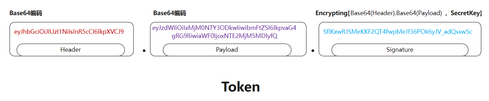

---
authors:
  - finn
date: 2023-08-14
categories:
  - Web
tags:
  - jwt
---
# JSON Web Token使用教程

JSON Web Token（JWT）作为一种流行的开放标准，为网络传递声明提供了一种简洁、安全的解决方案。无论是在单页应用程序、移动应用程序还是服务端应用程序中，JWT都发挥着重要的作用。

本博客将介绍JWT的原理、使用场景以及如何在应用程序中实现安全的身份验证和授权。无论您是开发人员、安全专家还是对网络安全感兴趣的读者，相信本文能够为您解答关于JWT的疑问，并帮助您更好地应用于实际项目中。

通过了解JWT，我们可以为我们的应用程序提供更加可靠和安全的身份验证解决方案，为用户提供更好的使用体验。让我们开始这段令人兴奋的旅程，深入了解JWT的精髓吧！

<!-- more -->

## 认识

>JSON Web Token (JWT) 是一个开放标准(RFC 7519)，它定义了一种紧凑的、自包含的方式，用于作为 JSON 对象在各方之间安全地传输信息。该信息可以被验证和信任，因为它是**数字签名**的。

快速访问：[JSON Web Tokens - jwt.io](https://jwt.io/) 

JWT的功能

- **身份验证（Authentication）**：JWT可以被用作身份验证机制，用于验证用户的身份信息。当用户成功登录并获得JWT后，他们可以在后续请求中通过将JWT附加到请求中来证明自己的身份。
	
- **授权（Authorization）**：JWT还可以用于授权用户访问特定资源或执行特定操作。在JWT的负载中，可以包含用户的权限或角色信息，服务器可以根据这些信息来判断用户是否有权访问特定资源。
	
- **信息交换（Information Exchange）**：由于JWT是基于JSON格式的，因此可以方便地在不同的系统之间传输和交换信息。JWT可以作为一种安全的机制，用于在不同的服务之间传递信息，而无需再次进行身份验证。

## 原理
### JWT组成
JWT令牌由三个部分组成，使用 `.` 进行分隔：

1. **Header（头部）**：包含描述 **JWT的元数据**，例如加密算法（例如HMAC、RSA等）和令牌类型（通常是JWT）。
2. **Payload（负载）**：包含要 **传输的数据**，以及一些预定义的声明（例如发行人、过期时间等）和自定义声明（根据需求添加）。
3. **Signature（签名）**：通过使用密钥对头部和负载进行加密生成的哈希值，用于 **验证令牌** 的完整性和真实性。

下图是JWT官网提供的JWT令牌工具，其中显示了Token的组成示例：

<figure markdown> 
    { width="750" }
    <figcaption>JWT示例</figcaption>
</figure>

JWT生成的Token是一串编码加密的字符串，格式形如  `XXX.YYY.ZZZ` 。`XXX` 部分是Header的Base64编码；`YYY` 部分是Payload的Base64编码；`ZZZ` 是将 `XXX` 和 `YYY` 拼接后通过加密秘钥（Secret Key）加密后形成的串。三者通过 `.` 拼接形成 Token .

<figure markdown> 
    { width="750" }
    <figcaption></figcaption>
</figure>

- Header
```json
{
	'typ': 'JWT', // 指定令牌的类型
	'alg': 'HS256' // 指定用于对JWT签名或加密的算法
}
// 头部用来存储描述JWT的元数据，这些数据是与令牌相关的信息。
```

- Payload
```json
{
  "sub": "1234567890", // 标识JWT所代表的主体或用户
  "exp": 1672417200, // 指定JWT的过期时间，用于限制JWT的有效期
  "roles": ["admin", "editor"], // 自定义
  "settings": { "notifications": true, "privacy": "private", "theme": "dark" } // 自定义
}
// 负载用来存储要传输的数据，即希望发送方携带的数据信息。
```

- Signature
```json
HMACSHA256(
  base64UrlEncode(header) + "." +
  base64UrlEncode(payload),
  "your_secret_key"
) 
// 签名是基于秘密密钥（或公钥/私钥对）生成的一串字符串，用于确保JWT在传输过程中没有被篡改。
```

!!! Note
	负载中的字段被称为声明（Claim），可以分为三类：注册声明，公共声明，私有声明。<br>
	- 注册声明：预定义的声明，推荐但不强制，例如 `sub` `iss` `aud` `exp` `nbf` `iat` `jti`；<br>
	- 公共声明：自定义的用于在JWT中携带一些公开的信息（如用户角色、权限等）；<br>
	- 私有声明：应用程序特定的声明，用于传递应用程序自定义的数据（如用户的自定义设置等）<br>
	公共声明和私有声明都是自定义声明，二者没有明确界限，这只是一种约定，并不存在一定要按照这种方式使用的规定。


!!! Warning "不要在JWT中携带敏感信息！"
	***JWT提供了一种用于传输信息和验证的机制，但不适宜存放敏感的隐私数据***。由于JWT是基于Base64编码的字符串，它是可解码的，因此不建议在JWT中存放敏感的隐私数据，例如密码、信用卡信息等。负载（Payload）部分通常用于存放一些非敏感的用户信息，如用户ID、角色、过期时间等。这些信息是公开的，并且也可以从JWT中解码和读取。**因此，敏感的隐私数据应该避免存放在JWT中，以防止信息泄露或被篡改。** 

### JWT认证流程

JWT认证流程总结起来就是前端通过发送身份信息给服务端，后端在接受到请求后会生成Token，并在响应中发送给前端。前端得到Token后保存在本地，在后续的请求中都会携带该Token，服务端对
令牌进行验证和授权访问。

下图显示了认证流程：

<figure markdown> 
    { width="750" }
    <figcaption>Token认证流程</figcaption>
</figure>

前端（客户端）：

1. 用户身份验证：用户通过提供凭据（例如用户名和密码）进行身份验证，通常通过登录页面或其他验证方式。
2. 发送身份验证请求：前端将用户的凭据发送到后端服务器，通常使用 POST 请求发送至特定的身份验证端点（如`/login`）。
3. 后端身份验证：后端服务器接收到身份验证请求后，对提供的凭据进行验证。如果验证成功，后端服务器将生成一个 JWT。
4. 接收和存储 JWT：后端服务器将生成的 JWT 作为响应返回给前端。前端通常会将 JWT 存储在客户端，例如使用浏览器的本地存储（LocalStorage）或移动应用的内存中。
5. 发送 JWT：前端在后续的请求中，将 JWT 添加到每次请求的 `Authorization` 头部中。可以使用 Bearer 认证方案，将 JWT 添加到头部中的 `Authorization` 字段值中。

后端（服务器）：

1. 验证 JWT：后端服务器接收到请求时，从 `Authorization` 头部中解析出 JWT，并对其进行验。
2. 验证签名：后端使用密钥对 JWT 的头部和负载进行签名验证，确保令牌的完整性。
3. 验证声明：后端检查负载中的声明，包括验证令牌的过期时间、发行人等。
4. 授权访问：如果 JWT 验证成功并且负载中的声明满足要求，后端服务器将对请求进行授权，允许访问受保护的资源或执行特定操作。

在验证 JWT 时，后端可以使用密钥来验证签名，并可以根据声明中的信息，确定用户的权限或角色。通常，JWT 包含有关用户身份的基本信息，如用户ID或用户名等。需要注意的是，为了防止 CSRF（跨站请求伪造）攻击，可以在生成的 JWT 中包含 CSRF Token，并在每个请求中进行验证。

总结起来，前端通过用户身份验证获取 JWT，并在后续请求中发送 JWT，而后端进行 JWT 的验证和授权访问。

## 项目中使用

下面的内容是在Webapi项目中配置JWT的基本步骤。在 ASP.NET Core Web API 中使用 JWT，你可以按照以下步骤进行设置：

1. 添加 NuGet 包：打开你的  Web API 项目，使用 NuGet 包管理器或在.csproj 文件中添加以下包引用，以添加一个 JWT 库（例如 `Microsoft.AspNetCore.Authentication.JwtBearer`）：
```xml
<PackageReference Include="Microsoft.AspNetCore.Authentication.JwtBearer" Version="x.x.x" />
```

2. 在 Startup.cs 中配置身份验证服务和 JWT：
	在 ConfigureServices 方法中添加以下代码来配置 JWT 身份验证服务：
	```csharp
	using Microsoft.AspNetCore.Authentication.JwtBearer; 
	using Microsoft.IdentityModel.Tokens;  
	// ...  
	public void ConfigureServices(IServiceCollection services) 
	{     
		// 配置身份验证服务     
		services
			.AddAuthentication(options =>     
			{         
				options.DefaultAuthenticateScheme = JwtBearerDefaults.AuthenticationScheme;
				options.DefaultChallengeScheme = JwtBearerDefaults.AuthenticationScheme;
			})
			.AddJwtBearer(options =>     
			{         
				// 设置 JWT Bearer 选项         
				options.TokenValidationParameters = new TokenValidationParameters
				{             
					ValidateIssuerSigningKey = true,             
					IssuerSigningKey = new 
					SymmetricSecurityKey(Encoding.ASCII.GetBytes("your_secret_key")),  
					ValidateIssuer = false, 
					ValidateAudience = false         
			};     
		});      
		// 添加其他服务配置    
		// ... 
	}
	```

3. 在 Configure 方法中启用身份验证：
```csharp
using Microsoft.AspNetCore.Authentication.JwtBearer;  

// ...  
public void Configure(IApplicationBuilder app, IWebHostEnvironment env) 
{     
	// 启用身份验证     
	app.UseAuthentication(); // 添加其他中间件配置     
	// ... 
}
```

4. 保护控制器或路由： 在需要身份验证的控制器或路由上添加 `[Authorize]` 属性，这将确保只有经过身份验证的用户可以访问相应的资源。
```csharp
using Microsoft.AspNetCore.Mvc;  

[ApiController]
[Route("api/[controller]")]
[Authorize] // 添加身份验证属性 
public class MyController : ControllerBase 
{     
	// ... 
}
```


至此，在你的 ASP.NET Core Web API 中已经集成了 JWT 身份验证。当客户端发送带有有效 JWT 的请求时，API 将进行身份验证，并允许访问受保护的资源。

你还需要在登录或注册等适当的地方生成 JWT，并将其返回给客户端作为身份验证凭据。通常，你可以使用第三方库（如 `System.IdentityModel.Tokens.Jwt`）来生成和签名 JWT。

!!! Danger
	请注意，上述示例中的密钥（`your_secret_key`）应该是一个长而安全的随机字符串，并且不应该在公共代码中硬编码。同时，请确保在生产环境中安全存储密钥。
