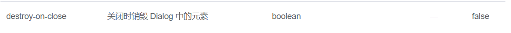
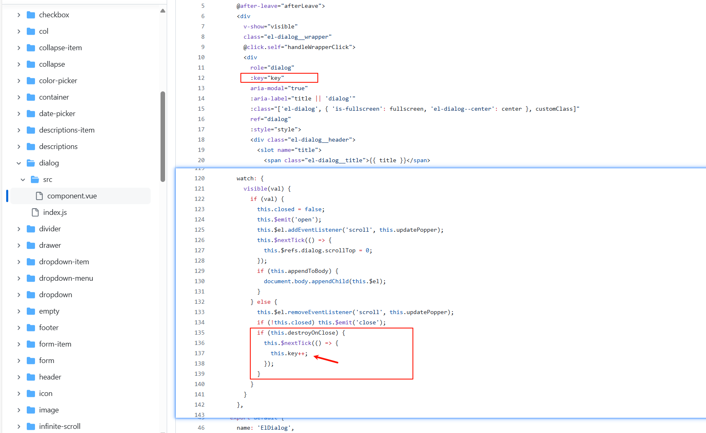

---
authors:
  - finnegan
date: 2024-06-04
categories:
  - Vue
  - ElementUI
tags:
  - vue2
  - el-dialog
draft: true
---
# 关于 el-dialog 关闭时销毁触发了挂载函数 mounted

<figure markdown> 
    { width="850" }
</figure>

<!-- more -->

## 情景再现
>设置了destroy-on-close为true的一个el-dialog，在关闭时候，触发了子组件的 mounted

## 原因

### el-dialog 源码

<figure markdown> 
    { width="850" }
</figure>

### key 变化引发的重新渲染

根据 Vue 文档对原生 key 属性的介绍：[内置的特殊 Attributes | Vue.js (vuejs.org)](https://cn.vuejs.org/api/built-in-special-attributes.html#key) 

当 Vue 中的 `key` 属性发生变化时，Vue 会进行一系列的操作来确保 DOM 的更新是准确且高效的。以下是当 `key` 发生变化时，Vue 会执行的步骤：

1. **查找旧节点**：
    - Vue 会首先查找虚拟 DOM（Virtual DOM）中具有旧 `key` 值的节点。
2. **匹配新节点**：
    - Vue 会尝试在新的虚拟 DOM 树中查找具有相同 `key` 值的新节点。
3. **更新或复用节点**：
    - 如果找到了具有相同 `key` 值的新节点，Vue 会尝试复用（即“就地更新”）旧节点。这意味着 Vue 会尽量重用现有的 DOM 元素，而不是销毁并重新创建它。这可以通过更新节点的属性、事件监听器等来实现，而不必经历完整的 DOM 操作，从而提高性能。
    - 如果节点的 `key` 值没有发生变化，Vue 会认为该节点是稳定的，会尽量复用该节点，只更新节点的内容。
4. **销毁旧节点并创建新节点**：
    - 如果没有找到具有相同 `key` 值的新节点，Vue 会销毁旧节点，并创建新节点。
5. **插入或移动节点**：
    - 如果新节点的位置与旧节点的位置不同，Vue 会执行 DOM 移动操作，而不是重新创建和插入新节点。这也有助于提高性能。

**归纳**：

- 当 `key` 发生变化时，Vue 会根据新的 `key` 值来决定是否复用、更新、移动或销毁 DOM 节点。
- 正确的使用 `key` 属性可以帮助 Vue 更准确地识别哪些节点可以复用，从而提高渲染性能和效率。
- 特别是在处理列表渲染时，为每一项提供一个唯一的 `key` 属性是非常重要的，这可以避免 Vue 在更新列表时出现不必要的 DOM 操作，如重新排序或重建节点。

请注意，Vue 官方建议在使用 `v-for` 指令时尽量提供 `key` 属性，除非遍历输出的 DOM 内容非常简单，或者是刻意依赖默认行为以获取性能上的提升。

## 解决办法

> 使用 v-if 来控制 el-dialog 中需要显示的子组件