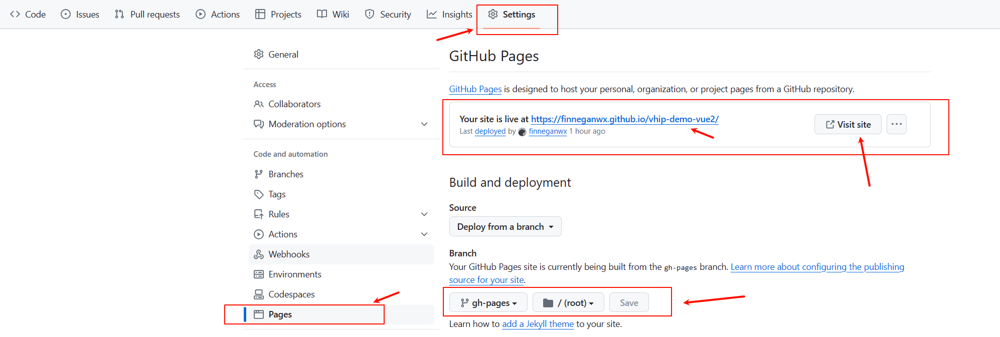

# 将 Vue 项目部署到 GitHub Pages

将 Vue 项目部署到 GitHub Pages 是一种简单而有效的方式，让你的网站快速上线并且免费托管。GitHub Pages 提供了一个便捷的平台，让开发者可以轻松地展示他们的项目，并且支持静态网页和基于 Jekyll 的网站。在这篇博客中，我们将介绍如何将 Vue 项目成功部署到 GitHub Pages，让你的作品能够被更多人访问和分享。

<!-- more -->

!!! info "准备工作"

	- [x] 创建一个 Vue 项目
	- [x] 注册 GitHub 账号
	- [x] 在 GitHub 新建一个存储该项目的仓库   
	- [x] 会使用 git 工具 


## 项目配置

针对部署后的访问地址需要配置项目的publicPath, 不同的配置会产生不同的访问地址，详细见下表：

| publicPath | 地址格式 | 示例 |
| :--- | :--- | :--- |
| `/` | `https://<your_github_username>.github.io/` | https://finneganwx.github.io/ |
| `/sub_route/` | `https://<your_github_username>.github.io/<sub_route>` | https://finneganwx.github.io/testpages |

下面是一个 vue.config.js 中配置 publicPath 的代码示例：
```js title="vue.config.js"
const { defineConfig } = require('@vue/cli-service')

module.exports = defineConfig({

  transpileDependencies: true,

  publicPath: '/vhip-demo-vue2/'

})
```

## 项目打包并推送

1. **打包**

	运行 `npm run build` 打包项目，默认会在项目目录下生成 `dist` 目录。
	
	<figure markdown> 
	    { width="450" }
	    <figcaption>dist</figcaption>
	</figure>
	

2. **推送当前项目到 Github 仓库**

	使用 `git push` 命令推送项目到远程仓库，包含打包生成的 dist 目录，请检查 .gitignore 是否忽略了该目录。

## 部署

使用如下命令将 `dist` 目录的内容推送到仓库的新分支 `gh-pages` 

```bash
git subtree push --prefix dist origin gh-pages
```

<figure markdown> 
	{ width="350" }
	<figcaption>gh-pages</figcaption>
</figure>
	
## 访问

登录 GitHub 远程仓库, 在该仓库下选择 Setting -> Pages 进入 GitHub Pages 的配置页面。上面部署一步完成后，GitHub 会默认设置好访问地址，在这里可以进行其他配置，也可以直接查看并点击链接访问网页。

<figure markdown> 
	{ width="750" }
	<figcaption>gh-pages</figcaption>
</figure>
