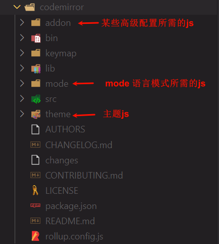

---
authors:
  - finn
date: 2024-02-20
categories:
  - Vue
  - CodeMirror
tags:
  - vue2
  - vue-codemirror
---
# 配置适用于 Vue 的 Web 代码编辑器

CodeMirror 是一种非常强大的代码编辑器，它提供了许多对于 Vue.js 项目的开发非常有用的功能。如果您正在构建 Vue.js 项目并需要一个高效、灵活且易于使用的代码编辑器，则 CodeMirror 可能是您需要的工具之一。本文将向您介绍使用 vue-codemirror 为 Vue.js 项目搭建一个优秀的代码编辑环境，以便为 Vue 项目打造出高效且愉悦的开发体验。让我们一起开始构建一个强大的代码编辑环境吧！

<!-- more -->
## 工具简介

!!! note ""

	CodeMirror 是一个基于Web技术的开源代码编辑器，为编写和编辑各种编程语言的代码提供了丰富的功能和工具。它可以用来替代浏览器默认的 textarea 元素，支持语法高亮、自动完成、括号匹配、代码折叠、多光标编辑等功能，同时还具有可扩展性和易于定制的 API 接口。CodeMirror 适用于许多不同的应用场景，如网站开发、代码编辑器、在线代码演示、博客编辑器等。CodeMirror 已被广泛应用于众多开源项目中，并得到了广大开发人员的青睐和喜爱。
	
	- CodeMirror 6 ：[CodeMirror](https://codemirror.net/) 
	- CodeMirror 5 ：[CodeMirror 5](https://codemirror.net/5/index.html) 


!!! note ""

	vue-codemirror 是一个基于 Vue.js 的代码编辑器组件，它集成了 CodeMirror 编辑器并提供了 Vue.js 组件化的封装。通过 Vue-Codemirror，开发人员可以在他们的 Vue 项目中轻松地实现功能强大的代码编辑器。Vue-Codemirror 支持诸如语法高亮、自动完成、代码折叠、多光标编辑等功能，并且与 Vue.js 框架无缝集成，使得在 Vue 项目中使用代码编辑器变得更加便捷和灵活。Vue-Codemirror 的易用性和灵活性使其成为许多 Vue.js 开发者首选的代码编辑器组件之一。

	- vue-codemirror 6.x :  [vue-codemirror - npm (npmjs.com)](https://www.npmjs.com/package/vue-codemirror) 
	- vue-codemirror 4.x : [surmon-china/vue-codemirror at v4.0.6 (github.com)](https://github.com/surmon-china/vue-codemirror/tree/v4.0.6) 


## vue-codemirror 的使用

### :hammer: 安装

```shell
// 直接安装会安装最新版本，仅支持Vue3.0 
npm i vue-codemirror --save

// Vue2.0 中需要指定安装4.x版本 
npm i vue-codemirror@4.x --save
```

> 安装 vue-codemirror 后会附带安装 codemirror，无需再次独立安装. 你可以在 node_modules 下找到它们.

### :pushpin: 引入

**全局引入** 

```javascript title="main.js"
import Vue from "vue"; 
import App from "./App"; 

// 导入与组件注册
import { codemirror } from "vue-codemirror";
Vue.component("codemirror", codemirror);

...

```

**局部引入** 

```javascript title="Your Component"
<template> 
	<div>
	</div>
</template> 

<script> 
// 导入
import { codemirror } from "vue-codemirror";
...

export default { 
	// 组件注册
	components: { codemirror }, 
	data() { 
		return { 
		},
	}
}; 
</script>
```

### :bulb: 使用

使用 codemirror 组件需要以下几个步骤：

1. 导入组件和一些样式资源
2. 编写 HTML 元素并绑定数据
3. 配置 codemirror 选项

**导入组件和一些样式资源** 

导入组件可按上述两种方式（全局和局部），这里不再赘述。

关于样式资源可以参考下面的内容（以局部导入为例）：

```javascript title="Your Component"
// 编辑器所需要的样式文件
import 'codemirror/lib/codemirror.css'

// 语言模式：根据不同的代码语言引入不同的js，你可以到 node_modules/codemirror/mode/ 下寻找需要的文件
import "codemirror/mode/javascript/javascript"

// 主题样式：代码块的主题，你可以到 node_modules/codemirror/theme/ 下寻找需要的文件
import 'codemirror/theme/idea.css'

// 附加功能：某些高级功能需要引入额外的 js 文件，你可以在 node_modules/codemirror/addon 下查找
// 代码折叠
import 'codemirror/addon/fold/foldgutter.css'
// 激活行高亮
import "codemirror/addon/selection/active-line.js"
// 其他
```

**编写 HTML 元素并绑定数据** 

导入并注册组件后就可以使用了，codemirror 需要两个数据，`value/v-model` 用来绑定代码段，`options` 用于配置选项.

```html
<!-- 双向绑定 使用 v-model -->
<codemirror v-model="code" :options="cmOptions"></codemirror>

<!-- 单向绑定 使用 value , 通过 input 事件获取输入的内容 -->
<codemirror :value="codestr"
			:options="cmOptions"
			@input="onCmCodeChange"></codemirror>
```

**配置 codemirror 选项** 

codemirror 选项通过 `options` 属性配置，下面是一个示例：

> 更多选项参考 CodeMirror 文档：[CodeMirror 5 User Manual](https://codemirror.net/5/doc/manual.html) 

```javascript
export default {
    components: {
        codemirror
    },
    data() {
        return {
            cmOptions: {
                mode: 'application/json',
                theme: 'idea',
                // 是否显示行号
                lineNumbers: true,
                // 是否自动换行
                lineWrapping: true,
                // 代码折叠
                foldGutter: true,
                // 沟槽样式，传入数组会按顺序依次应用
                // 左侧是行号，行号右侧是折叠箭头
                gutters: ["CodeMirror-linenumbers", "CodeMirror-foldgutter"],
                // 高亮选中的行
                styleActiveLine: true,
            };
        }
    },
}
```


### :egg: 资源介绍

上文提到的代码模式 mode 主题 theme 高级配置 addon 等所需要的 js 资源所在位置参考下图（node_modules/）：
<figure markdown> 
    { width="650" }
    <figcaption>codemirror资源介绍</figcaption>
</figure>

另外，对于一些常用总结见下表：

| 分类 | 代码 | 说明 |
| :--- | :--- | :--- |
| mode | text/javascript | JavaScript |
|  | text/html | HTML |
|  | text/css | CSS |
|  | application/xml | XML |
|  | application/json | JSON |
|  | text/x-python | Python |
|  | text/x-java | Java |
|  | text/x-ruby | Ruby |
|  | text/x-c++src | C++ |
|  | text/x-csharp | C# |
| theme | cobalt | cobalt |
|  | dracula | dracula |
|  | monokai | monokai |
|  | idea | idea |
> 不要忘记导入 js 哦~

## 封装一个组件

下面是一个封装好的组件，拿去用吧 🎉 ！

```html
<template>
    <div>
        <codemirror ref="cm"
                    :value="codestr"
                    :options="cmOptions"
                    @input="onCmCodeChange"></codemirror>

    </div>
</template>

<script>
import { codemirror } from 'vue-codemirror'
import 'codemirror/lib/codemirror.css'

import "codemirror/mode/javascript/javascript"
import 'codemirror/theme/idea.css'

import 'codemirror/addon/fold/foldgutter.css"
import "codemirror/addon/selection/active-line.js"

export default {
    name: "CodeBlock",
    components: {
        codemirror
    },
    props: {
        codestr: {
            type: String,
            default: ""
        },
        codemode: {
            type: String,
            default: "json",
            validator: function (value) {
                return ['application/json'].includes(value);
            }

        },
        codetheme: {
            type: String,
            default: "idea",
            validator: function (value) {
                return ['idea'].includes(value);
            }
        }
    },
    mounted() {
        this.$refs.cm.codemirror.setSize("100%", 'auto');

    },
    computed: {
        cmOptions() {
            return {
                mode: this.codemode,
                theme: this.codetheme,

                // 是否显示行号
                lineNumbers: true,
                // 是否自动换行
                lineWrapping: true,

                // 代码折叠
                foldGutter: true,

                // 沟槽样式，传入数组会按顺序依次应用
                // 左侧是行号，行号右侧是折叠箭头
                gutters: ["CodeMirror-linenumbers", "CodeMirror-foldgutter"],

                // 高亮选中的行
                styleActiveLine: true,
            };
        }
    },

    data() {
        return {
            code: this.codestr
        }
    },

    methods: {
        getCurrentCode() {
            return this.code;
        },
        onCmCodeChange(newCode) {
            this.code = newCode;
        },
    },
}
</script>
```