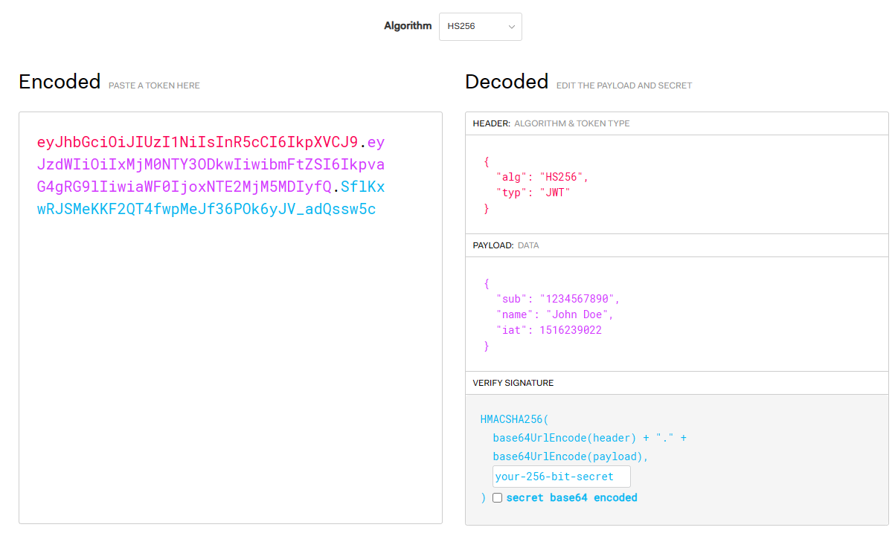

# JWT使用教程

## 1. 认识JWT

>JSON Web Token (JWT) 是一个开放标准(RFC 7519)，它定义了一种紧凑的、自包含的方式，用于作为 JSON 对象在各方之间安全地传输信息。该信息可以被验证和信任，因为它是**数字签名**的。

快速访问：[JSON Web Tokens - jwt.io](https://jwt.io/) 

### 1.1 JWT的功能
- **身份验证（Authentication）**：JWT可以被用作身份验证机制，用于验证用户的身份信息。当用户成功登录并获得JWT后，他们可以在后续请求中通过将JWT附加到请求中来证明自己的身份。
	
- **授权（Authorization）**：JWT还可以用于授权用户访问特定资源或执行特定操作。在JWT的负载中，可以包含用户的权限或角色信息，服务器可以根据这些信息来判断用户是否有权访问特定资源。
	
- **信息交换（Information Exchange）**：由于JWT是基于JSON格式的，因此可以方便地在不同的系统之间传输和交换信息。JWT可以作为一种安全的机制，用于在不同的服务之间传递信息，而无需再次进行身份验证。

## 2. JWT原理
### 2.1 JWT组成
JWT令牌是 它由三个部分组成，使用 `.` 进行分隔：

1. **Header（头部）**：包含描述**JWT的元数据**，例如加密算法（例如HMAC、RSA等）和令牌类型（通常是JWT）。
2. **Payload（负载）**：包含要**传输的数据**，以及一些预定义的声明（例如发行人、过期时间等）和自定义声明（根据需求添加）。
3. **Signature（签名）**：通过使用密钥对头部和负载进行加密生成的哈希值，用于**验证令牌**的完整性和真实性。

最终生成的JWT令牌形如：`xxxxx.yyyyy.zzzzz` ，下图显示了JWT令牌示例：

<figure markdown> 
    { width="600" }
    <figcaption>JWT示例</figcaption>
</figure>

上图是JWT官网提供的JWT验证工具，可以使用它来对Token进行加解密验证。

- Header
```json
{
	'typ': 'JWT',
	'alg': 'HS256'
}
```
头部用来存储JWT的相关信息，比如 `typ` 用于指定令牌的类型，通常是"JWT"；`alg` 指定用于对JWT签名或加密的算法，例如"HMACSHA256"、"RSA"等。当然还有其他字段，甚至自定义。

需要注意的是：Header中的属性是公开信息，不应包含敏感或保密数据。

- Payload
```json
{
  "sub": "1234567890",
  "name": "John Doe",
  "iat": 1516239022
}
```
负载用来存储要传输的数据，比如 `sub` 用于标识JWT所代表的主体或用户，可以是用户ID，用户名等信息； `exp` 指定了JWT的过期时间，用于限制JWT的有效期；`iss` 表示发行该JWT的实体，即JWT的颁发者；`iat` 指定JWT的颁发时间，表示该JWT令牌的生成时间等，还可以增加其他自定义声明，以满足应用程序的需求。

负载中的


- Signature
```json
HMACSHA256(
  base64UrlEncode(header) + "." +
  base64UrlEncode(payload),
  "your_secret_key"
)
```
签名是基于秘密密钥（或公钥/私钥对）生成的一串字符串，用于确保JWT在传输过程中没有被篡改。签名加密的算法在Header的 `alg` 中指定，然后将头部信息和负载信息分别编码拼接在一起，通过算法和加密秘钥进行加密生成。当然，秘钥也可以先进行编码再用来加密。

!!! Warning
	<mark style="background: #D2B3FFA6;">JWT提供了一种用于传输信息和验证的机制，但不适宜存放敏感的隐私数据。</mark>由于JWT是基于Base64编码的字符串，它是可解码的，因此不建议在JWT中存放敏感的隐私数据，例如密码、信用卡信息等。负载（Payload）部分通常用于存放一些非敏感的用户信息，如用户ID、角色、过期时间等。这些信息是公开的，并且可以从JWT中解码和读取。因此，敏感的隐私数据应该避免存放在JWT中，以防止信息泄露或被篡改。

### 2.2 JWT认证流程


### 2.3 JWT使用步骤


## 3. .NET配置JWT认证

