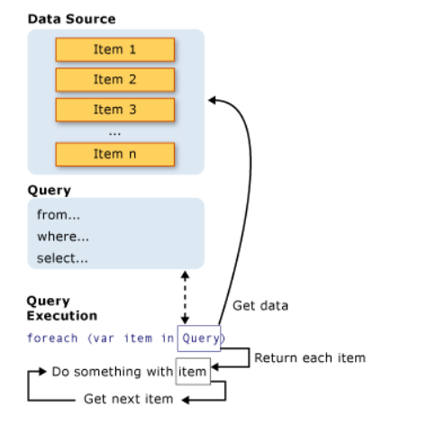

# 了解 LINQ

## 一、LINQ 是什么

### 01 Linq 简介
语言集成查询（Language integrated query，LINQ）是 .Net 3.5 和 Visual Studio 2008 引入的功能强大的查询语言，是一系列直接将查询功能集成到 C# 语言的技术统称。例如，SQL 是一种结构化查询语言，用于保存和检索数据库中的数据。同样，LINQ 是 C＃和 VB.NET 中内置的结构化查询语法，用于从不同类型的数据源中检索数据。

在 C# 中可为以下对象编写 LINQ 查询：SQL Server 数据库、XML 文档、ADO.NET 数据集以及支持`IEnumerable` 或泛型 `IEnumerable<T>` 接口的任何对象集合。 此外，第三方也为许多 Web 服务和其他数据库实现提供了 LINQ 支持。

LINQ 查询将结果作为对象返回。它使您可以在结果集上使用面向对象的方法，而不必担心将不同格式的结果转换为对象。下面为 LINQ 的简单示例，您可以从中体会它的用法和作用：

示例：
```csharp
// 设置数据源
int[] scores = { 97, 92, 81, 60 };

// 定义LINQ查询表达式
IEnumerable<int> scoreQuery =
    from score in scores
    where score > 80
    select score;

// 执行查询
foreach (int i in scoreQuery)
{
    Console.Write(i + " ");
}

// Output: 97 92 81
```


### 02 Linq 的优势 [^1]

[^1]: https://www.cainiaojc.com/linq/why-linq.html

-   **Familiar language（熟悉的语言）:** 开发人员不必为每种类型的数据源或数据格式学习新的查询语言。
-   **Less coding（更少的代码）:** 与更传统的方法相比，它减少了要编写的代码量。
-   **Readable code（代码可读性）:** LINQ使代码更具可读性，因此其他开发人员可以轻松地理解和维护它。
-   **Standardized way of querying multiple data sources（查询多个数据源的标准化方法）:** 相同的LINQ语法可用于查询多个数据源。
-   **Compile time safety of queries（查询的编译时安全性）:** 它在编译时提供对象的类型检查。
-   **IntelliSense support（智能感知支持）:** LINQ为通用集合提供了IntelliSense。
-   **Shaping data（数据形状）:** 您可以以不同形状检索数据。

## 二、LINQ 查询

### 01 Linq 查询过程
所有 LINQ 查询操作都由以下三个不同的操作组成：

1.  获取数据源（Data source）；
2.  创建查询（Query creation）；
3.  执行查询（Query execution）。

在 LINQ 中，查询的执行不同于查询本身，仅通过创建查询变量不会检索到任何数据。下图演示完整的查询操作：
<figure markdown> 
    { width="600" }
    <figcaption>Linq查询过程</figcaption>
</figure>

### 02 数据源
LINQ 支持诸多类型的数据源，包括 **SQL Server**、**XML文件**、**ADO.NET DataSet**、支持 `IEnumerable` 或泛型 `IEnumerable<T>` 接口的任何对象**集合**以及 LINQ 提供程序可用的任何其他格式的数据等。

!!! Note
	示例中的数据源为数组，它隐式地支持泛型 `IEnumerable<T>` 接口，因此可以作为数据源进行LINQ查询。

可查询类型不需要进行修改或特殊处理就可以用作 LINQ 数据源，如果源数据还没有作为可查询类型出现在内存中，则 LINQ 提供程序必须以此方式表示源数据。 例如，LINQ to XML 将 XML 文档加载到可查询的 [XElement](https://learn.microsoft.com/zh-cn/dotnet/api/system.xml.linq.xelement) 类型中：

```csharp
// Create a data source from an XML document.
// using System.Xml.Linq;
XElement contacts = XElement.Load(@"c:\myContactList.xml");
```

### 03 查询表达式
查询表达式用于从数据源中检索的数据。查询表达式采用声明性查询语法编写而成。 使用查询语法，可以用最少的代码对数据源执行筛选、排序和分组操作。可使用相同的基本查询表达式模式来查询和转换 SQL 数据库、ADO .NET 数据集、XML 文档和流以及 .NET 集合中的数据。

!!! Info
	在C#中编写LINQ查询有三种方式：查询语法、方法语法、查询语法与方法语法结合。查询表达式是以查询语法表示的查询。关于查询语法以及方法语法的介绍请参考后续章节。

!!! Note "查询表达式概述"
	* :one: 查询表达式可用于查询并转换所有启用了 LINQ 的数据源中的数据。 例如，通过一个查询即可检索 SQL 数据库中的数据，并生成 XML 流作为输出。
	* :two: 查询表达式易于掌握，因为它们使用了许多熟悉的 C# 语言构造。
	* :three: 查询表达式中的变量全都是强类型，尽管在许多情况下，无需显式提供类型，因为编译器可以推断出。
	* :four: 只有在循环访问查询变量后，才会执行查询（例如，在 `foreach` 语句中）。
	* :five: 在编译时，查询表达式根据 C# 规范规则转换成标准查询运算符方法调用。 可使用查询语法表示的任何查询都可以使用方法语法进行表示。 不过，在大多数情况下，查询语法的可读性更高，也更为简洁（关于查询语法与方法语法请参考后续章节）。
	* :six: 通常，建议在编写 LINQ 查询时尽量使用查询语法，并在必要时尽可能使用方法语法。 这两种不同的形式在语义或性能上毫无差异。 查询表达式通常比使用方法语法编写的等同表达式更具可读性。
	* :seven: 一些查询操作（如 Count 或 Max）没有等效的查询表达式子句，因此必须表示为方法调用。 可以各种方式结合使用方法语法和查询语法。
	* :eight: 查询表达式可被编译成表达式树或委托，具体视应用查询的类型而定。 IEnumerable<T\>类型查询编译为委托。 IQueryable 和 IQueryable<T\>查询编译为表达式树。


### 04 查询变量
LINQ 查询变量被类型化为 [IEnumerable<T\>](https://learn.microsoft.com/zh-cn/dotnet/api/system.collections.generic.ienumerable-1)  或派生类型（如 [IQueryable<T\>](https://learn.microsoft.com/zh-cn/dotnet/api/system.linq.iqueryable-1)）。在 LINQ 中，<mark style="background: #CACFD9A6;">查询变量是存储查询而不是查询结果的任何变量</mark>。更具体地说，查询变量始终是可枚举类型，在 `foreach` 语句或对其 `IEnumerator.MoveNext()` 方法的直接调用中循环访问时会生成元素序列。

查询存储在查询变量中，并用查询表达式进行初始化。目前需要注意的是，在 LINQ 中，查询变量本身不执行任何操作并且不返回任何数据。 它只是存储在以后某个时刻执行查询时为生成结果而必需的信息。

!!! Tip
	如果愿意，可以使用 `var` 关键字来避免使用泛型语法。 `var` 关键字指示编译器通过查看在 `from` 子句中指定的数据源来推断查询变量的类型。通常，如果使用 `var`，应意识到这可能使他人更难以理解代码。


### 05 执行查询
查询的执行分为延迟执行与立即执行。

**延迟执行** 
上述示例中采用的是延迟执行，查询过程延迟到 `foreach` 中，当代码执行至 `foreach` 时，才会进行查询。
```csharp
foreach (int i in scoreQuery)
{
    Console.Write(i + " ");
}
```
由于查询变量本身从不保存查询结果，因此可以根据需要随意执行查询。 例如，可以通过一个单独的应用程序持续更新数据库。 在应用程序中，可以创建一个检索最新数据的查询，并可以按某一时间间隔反复执行该查询以便每次检索不同的结果。

**立即执行** 
对一系列源元素执行聚合函数的查询首先循环访问这些元素。 `Count`、`Max`、`Average` 和 `First` 就属于此类查询，这些查询在执行时不使用显式 `foreach` 语句。
```csharp
var evenNumQuery =
    from num in numbers
    where (num % 2) == 0
    select num;

int evenNumCount = evenNumQuery.Count();
```

要强制立即执行任何查询并缓存其结果，可调用表达式的 `ToList()` 或 `ToArray()` 方法。

```csharp
List<int> numQuery2 =
    (from num in numbers
     where (num % 2) == 0
     select num).ToList();

// or like this:
// numQuery3 is still an int[]

var numQuery3 =
    (from num in numbers
     where (num % 2) == 0
     select num).ToArray();
```

此外，还可以通过在紧跟查询表达式之后的位置放置一个 `foreach` 循环来强制执行查询。 但是，通过调用 `ToList()` 或 `ToArray()`，也可以将所有数据缓存在单个集合对象中。